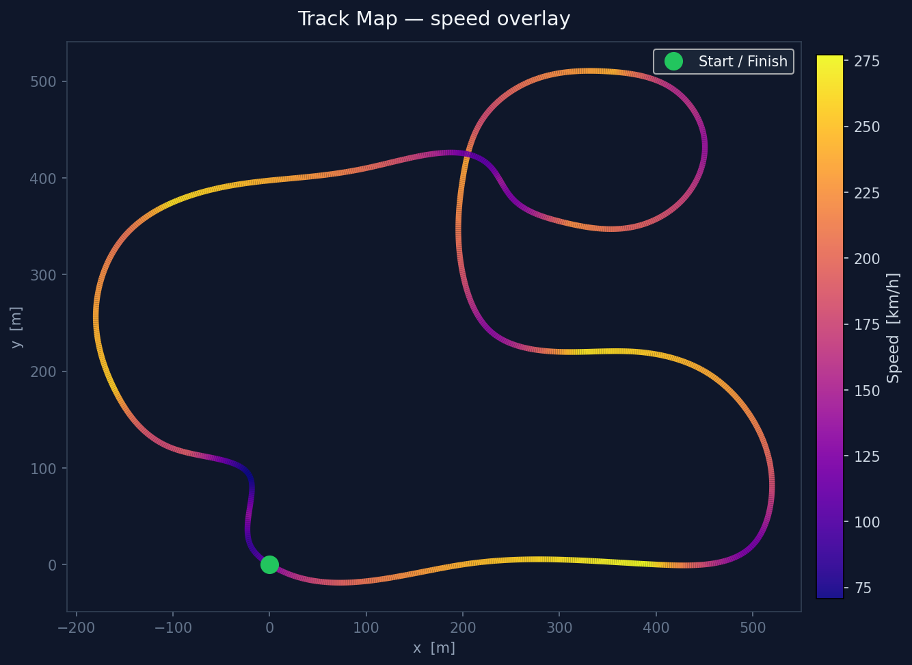
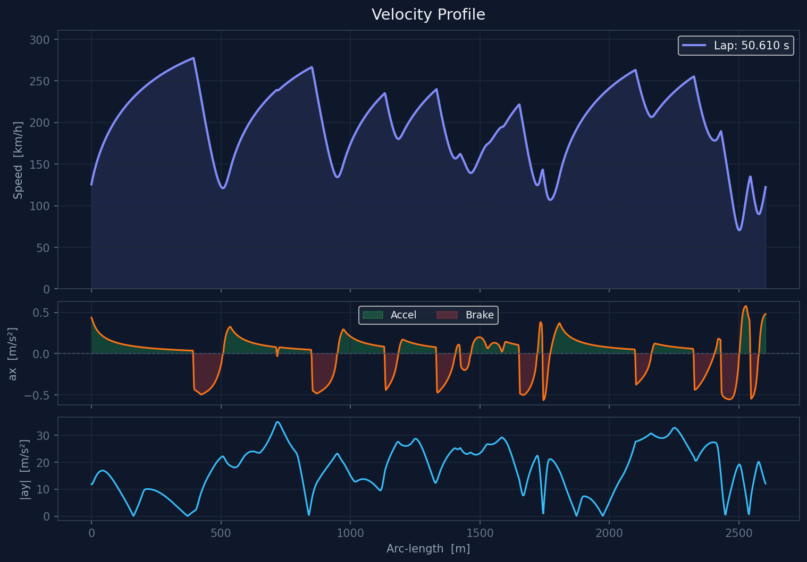
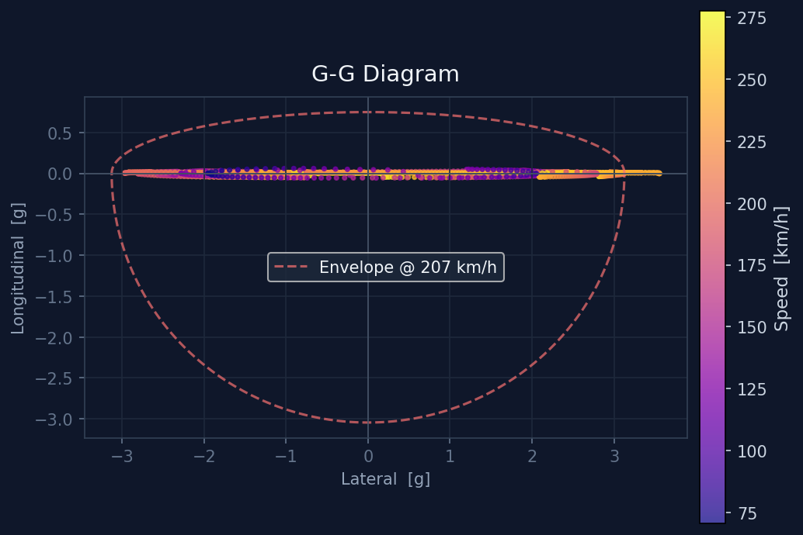
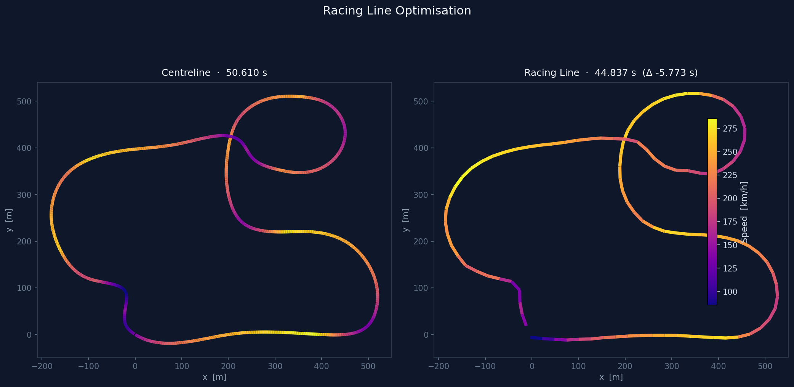

# Lap Time Simulator

A physics-based lap time simulator and racing line optimiser with an interactive web dashboard. Upload any track geometry, tune vehicle parameters in real time, and see the velocity profile, G-G diagram, and optimal racing line update instantly.


---

## Features

- **Quasi-Steady-State (QSS) simulation** — O(N) forward/backward pass, solves a full lap in milliseconds
- **Point-mass vehicle model** — traction ellipse with speed-dependent downforce and drag, power-limited acceleration, parametric for any vehicle category (kart, Formula, GT, …)
- **Minimum-curvature racing line optimiser** — finds the path through the track that minimises curvature, reducing lap time without full optimal control
- **Interactive web dashboard** — dark-themed React 18 UI with Plotly charts; adjust vehicle sliders and re-simulate instantly
- **REST API** — upload tracks, run simulations, and trigger optimisation programmatically via FastAPI
- **CSV and GPX track loading** — bring your own circuit data; GPX files are automatically geo-referenced to a local Cartesian frame
- **Docker Compose** — one command starts the full stack

---

## Screenshots

### Dashboard — full layout

The main dashboard shows the track map (coloured by speed), velocity profile, and G-G diagram side by side. The vehicle parameter panel is on the left.


### Track map — velocity overlay

Each segment is coloured by instantaneous speed using the Plasma colour scale. The green star marks the start/finish line.



### Velocity profile

Three sub-plots show speed, longitudinal acceleration (green = throttle, red = brake), and lateral acceleration vs arc-length.



### G-G diagram

The friction envelope at median speed is shown as a dashed red boundary. Each point is the vehicle state at one simulation station, coloured by speed.



### Racing line optimisation

Left: baseline simulation on the track centreline (50.6 s). Right: minimum-curvature racing line (44.8 s). The path widens in slow corners and tightens on straights.



---

## Quick Start

### Option 1 — Docker Compose (recommended)

```bash
git clone https://github.com/cieslakmp/laptime-sim.git
cd laptime-sim
docker-compose up
```

Open **http://localhost:5173** for the web dashboard.  
API docs are at **http://localhost:8000/docs**.

### Option 2 — Local development

**Backend**

```bash
# Python 3.11+ required
pip install -e ".[dev]"
uvicorn laptime.api.main:app --reload
# → http://localhost:8000
```

**Frontend**

```bash
cd frontend
npm install
npm run dev
# → http://localhost:5173
```

---

## Using the Dashboard

1. **Upload a track** — click *Upload Track (CSV/GPX)* in the header and select a file. The track map renders immediately.
2. **Adjust vehicle parameters** — use the sliders in the left panel to set mass, peak power, tyre friction, downforce, and drag.
3. **Simulate** — click *Simulate* to run the QSS solver. The velocity profile and G-G diagram appear within a second.
4. **Optimise racing line** — click *Optimise Line* to run the minimum-curvature optimiser (~20–30 s). The baseline and optimised velocity profiles are overlaid for direct comparison.

---

## Track File Formats

### CSV (recommended for custom tracks)

```
# columns: x_m, y_m[, width_left_m, width_right_m, banking_rad]
# Lines starting with '#' and the header row are ignored
0.0,   0.0,   7.0, 7.0, 0.0
100.0, 5.0,   7.0, 7.0, 0.0
200.0, 0.0,   7.0, 7.0, 0.0
...
```

- `x_m`, `y_m` — centreline coordinates in metres
- `width_left_m`, `width_right_m` — track half-width each side (default 5 m)
- `banking_rad` — banking angle in radians, positive tilts the right side up (default 0)

The track loader fits a periodic cubic spline through the raw points and resamples at the requested spatial resolution (default 2 m). Width and banking columns are optional; omitting them gives a flat, 10 m wide track.

### GPX

Standard GPS exchange format. The first track segment is used. Latitude/longitude is converted to a local Cartesian frame via a transverse Mercator projection centred on the track centroid.

### Bundled examples

| File | Description |
|---|---|
| `data/tracks/example_oval.csv` | Oval circuit, ~1.9 km perimeter |
| `data/tracks/example_circuit.csv` | Mixed circuit with hairpins and straights, ~2.8 km |

---

## Vehicle Parameters

All parameters are exposed as sliders in the dashboard and as fields in the `POST /simulate` body.

| Parameter | Default | Description |
|---|---|---|
| `mass_kg` | 700 | Total mass including driver [kg] |
| `p_max_kw` | 400 | Peak engine power [kW] |
| `f_brake_max_n` | 20 000 | Peak brake force [N] |
| `mu_y` | 1.8 | Peak lateral tyre friction coefficient |
| `mu_x` | 1.6 | Peak longitudinal tyre friction coefficient |
| `cl` | 2.5 | Aerodynamic downforce coefficient Cl·A [m²] |
| `cd` | 0.9 | Aerodynamic drag coefficient Cd·A [m²] |
| `v_max_ms` | 83 | Top speed cap [m/s] |

TOML config files can also be used (see `data/vehicles/`):

```toml
# data/vehicles/formula_student.toml
[vehicle]
mass_kg          = 300.0
p_max_kw         = 80.0
f_brake_max_n    = 8000.0
mu_x             = 1.6
mu_y             = 1.8
cd               = 0.5
cl               = 1.5
aero_ref_area_m2 = 1.2
v_max_ms         = 40.0
```

---

## REST API

Interactive docs (Swagger UI) available at **http://localhost:8000/docs**.

### Upload a track

```bash
curl -X POST http://localhost:8000/tracks \
     -F "file=@data/tracks/example_circuit.csv"
# → {"track_id": "a3f9c2b1d4e8", "name": "example_circuit",
#    "length_m": 2783.4, "n_points": 1391}
```

### Run a simulation

```bash
curl -X POST http://localhost:8000/simulate \
     -H "Content-Type: application/json" \
     -d '{
       "track_id": "a3f9c2b1d4e8",
       "vehicle": {
         "mass_kg": 700, "p_max_kw": 400,
         "mu_y": 1.8, "cl": 2.5, "cd": 0.9,
         "v_max_ms": 83
       }
     }'
# → {"lap_time_s": 50.61, "s": [...], "v_ms": [...], ...}
```

### Optimise the racing line

```bash
curl -X POST http://localhost:8000/optimize \
     -H "Content-Type: application/json" \
     -d '{"track_id": "a3f9c2b1d4e8", "vehicle": {...}}'
# → {"baseline_lap_time_s": 50.61,
#    "optimized_lap_time_s": 44.84,
#    "delta_s": -5.77, ...}
```

---

## Python Library

The simulator is a clean importable library — use it directly in scripts or Jupyter notebooks without the web layer:

```python
from laptime.track.loader import load_csv
from laptime.vehicle.params import PointMassParams
from laptime.vehicle.point_mass import PointMassVehicle
from laptime.sim.qss import QSSSolver

track   = load_csv("data/tracks/example_circuit.csv")
vehicle = PointMassVehicle(PointMassParams(mass_kg=700, p_max_kw=400,
                                           mu_y=1.8, cl=2.5, cd=0.9))
result  = QSSSolver(track, vehicle).solve()

print(f"Lap time: {result.lap_time_s:.3f} s")
# → Lap time: 50.610 s
```

### Matplotlib visualisation

```python
from laptime.viz import plot_track_map, plot_velocity_profile, plot_gg_diagram
import matplotlib.pyplot as plt

fig, axes = plt.subplots(1, 3, figsize=(16, 5))
plot_track_map(track, result, ax=axes[0])
plot_velocity_profile(result, ax=axes[1])
plot_gg_diagram(result, vehicle, ax=axes[2])
plt.tight_layout()
plt.show()
```

### Racing line optimisation

```python
from laptime.optimizer.racing_line import MinCurvatureOptimizer

opt       = MinCurvatureOptimizer(track, n_points=200)
alpha     = opt.optimize()          # alpha[i] ∈ [-1, 1] across track width
opt_track = opt.apply_to_track(alpha)

opt_result = QSSSolver(opt_track, vehicle).solve()
print(f"Racing line: {opt_result.lap_time_s:.3f} s  "
      f"(Δ {opt_result.lap_time_s - result.lap_time_s:+.3f} s)")
# → Racing line: 44.837 s  (Δ -5.773 s)
```

---

## Architecture

```
laptime-sim/
├── laptime/                   Python library
│   ├── track/
│   │   ├── geometry.py        Spline fitting, arc-length, analytical curvature
│   │   ├── track.py           Track dataclass (arc-length parameterised)
│   │   └── loader.py          CSV / GPX → Track
│   ├── vehicle/
│   │   ├── base.py            VehicleModel ABC
│   │   └── point_mass.py      Traction ellipse + aero + powertrain
│   ├── sim/
│   │   └── qss.py             QSS forward/backward pass solver
│   ├── optimizer/
│   │   └── racing_line.py     Min-curvature SLSQP optimiser
│   ├── viz/                   Matplotlib helpers
│   └── api/                   FastAPI app + routes
├── frontend/                  React 18 + TypeScript dashboard
│   └── src/
│       ├── App.tsx
│       ├── api/client.ts
│       └── components/
│           ├── TrackMap.tsx
│           ├── VelocityProfile.tsx
│           ├── GGDiagram.tsx
│           └── VehicleForm.tsx
├── tests/                     pytest + hypothesis
├── data/                      Example tracks and vehicle configs
└── docker-compose.yml
```

### Key design decisions

**Arc-length as the universal coordinate.** Everything — velocity profile, curvature, G-G forces — lives in the `s`-domain. This decouples geometry from physics, keeps interpolation trivial, and makes periodic boundary conditions for closed circuits natural.

**`VehicleModel` ABC as the extension point.** The QSS solver only calls `lateral_limit(v)` and `longitudinal_limits(v, ay)`. Swapping in a GGV table, a bicycle model, or a neural-network surrogate requires zero changes to the simulator.

**QSS is O(N) and runs in milliseconds.** This makes real-time interactivity in the dashboard practical — every slider change can trigger a full re-simulation.

---

## Development

### Running tests

```bash
pytest                    # all tests
pytest tests/sim/         # QSS tests only
pytest -v --tb=short      # verbose
```

### Project dependencies

```bash
pip install -e ".[dev]"   # core + dev tools (pytest, ruff, mypy, matplotlib, plotly)
pip install -e ".[ocp]"   # optional: CasADi for full optimal control (Phase 4)
```

### Linting and type checking

```bash
ruff check laptime/
mypy laptime/
```

---

## Roadmap

| Phase | Status | Description |
|---|---|---|
| 1 — Core library | ✅ Done | Track geometry, point-mass vehicle, QSS solver, matplotlib viz |
| 2 — REST API | ✅ Done | FastAPI with track upload, simulate, optimise endpoints |
| 3 — Web dashboard | ✅ Done | React 18 + Plotly: track map, velocity profile, G-G diagram |
| 4 — Full OCP | Planned | CasADi + IPOPT optimal control (simultaneous line + inputs) |
| 5 — GGV vehicle | Planned | Speed-dependent 3-D lookup table from measured data |
| 6 — Bicycle model | Planned | Kinematic single-track model for transient dynamics |
| 7 — Parameter sweep | Planned | Vectorised setup sensitivity / tornado plots |

---

## License

MIT
