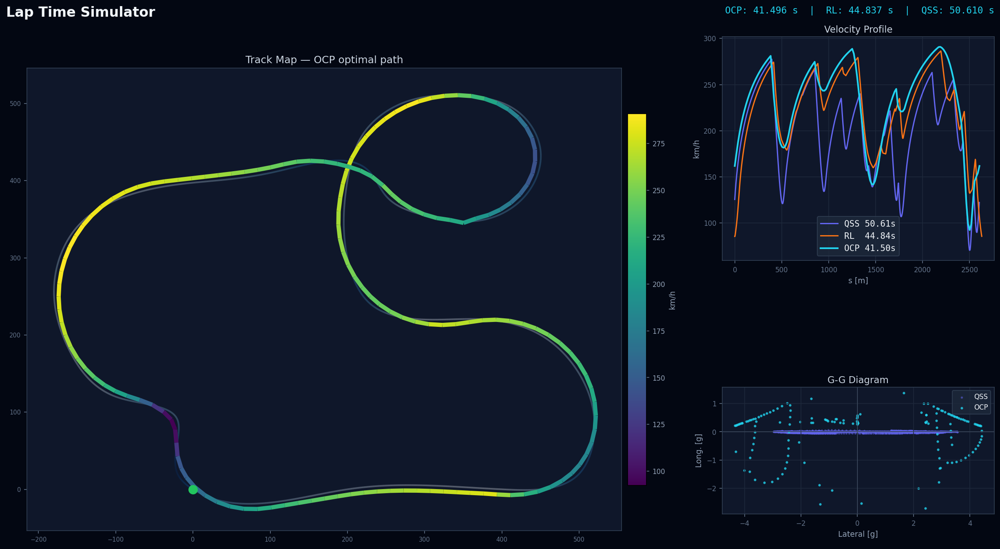
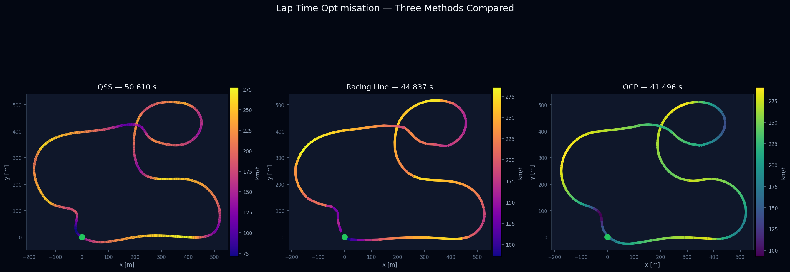
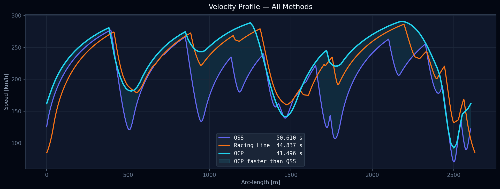
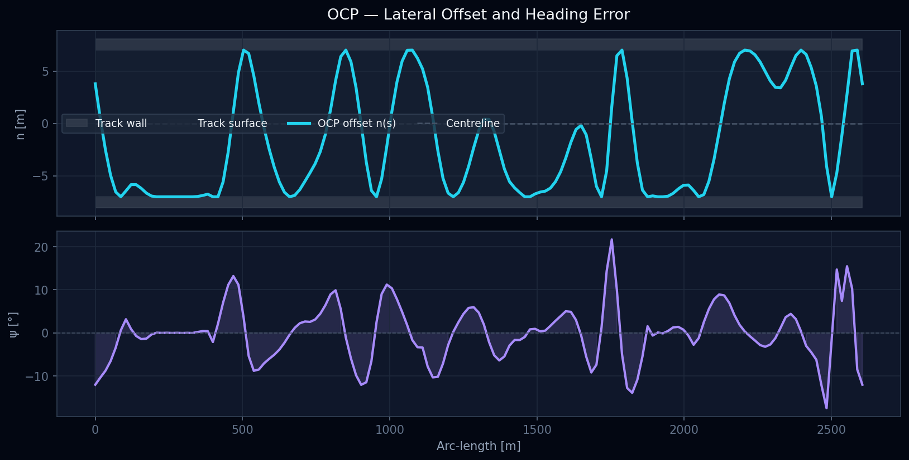
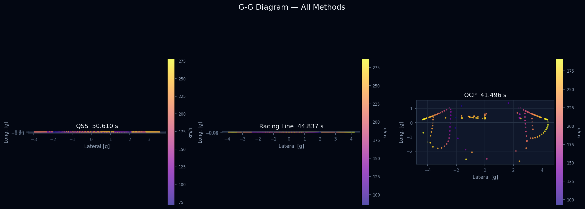

# Lap Time Simulator

A physics-based lap time simulator and racing line optimiser with an interactive web dashboard. Upload any track geometry, tune vehicle parameters in real time, and compare three levels of optimisation — from a millisecond QSS pass to a full optimal control problem solved with CasADi + IPOPT.



---

## Features

- **Quasi-Steady-State (QSS) simulation** — O(N) forward/backward pass, solves a full lap in milliseconds
- **Minimum-curvature racing line** — geometric optimiser that finds the smoothest path through the track width
- **Full optimal control (OCP)** — minimum-time direct multiple shooting (CasADi + IPOPT) in curvilinear coordinates; simultaneous optimisation of racing line and velocity profile
- **Point-mass vehicle model** — traction ellipse with speed-dependent downforce and drag, power-limited acceleration, parametric for any category (kart, Formula, GT, …)
- **Interactive web dashboard** — dark-themed React 18 UI; adjust vehicle sliders and overlay all three methods at once
- **REST API** — upload tracks, run simulations, and trigger optimisation programmatically via FastAPI
- **CSV and GPX track loading** — bring your own circuit data; GPX files are automatically geo-referenced

---

## Results at a glance

| Method | Lap time | vs QSS |
|---|---|---|
| QSS (centreline) | 50.610 s | — |
| Racing line (min-curvature) | 44.837 s | −5.773 s |
| **Full OCP** | **41.496 s** | **−9.114 s** |

*Example circuit, ~2.8 km. OCP solves in ~3 s warm-started from QSS.*

---

## Screenshots

### Dashboard

The main layout: OCP optimal path overlaid on the track map (viridis), all three velocity profiles, and the G-G diagram — updated live as vehicle sliders change.


### Three-method track map comparison

Left to right: QSS on the centreline, min-curvature racing line, and full OCP optimal path — all coloured by speed.



### Velocity profiles overlaid

The cyan shaded region shows where OCP exceeds QSS speed. The OCP carries more speed through every corner because it simultaneously optimises the line and the throttle/brake profile.



### OCP lateral offset and heading error

The OCP state trajectory: lateral offset `n(s)` relative to the centreline (bounded by track walls), and heading error `ψ(s)` relative to the track tangent. These are the state variables that the QSS solver cannot access.



### G-G diagram

All three methods side by side. The OCP solution (right) fills the friction envelope more completely, particularly in the longitudinal direction, because it can simultaneously choose the corner entry/exit geometry.



---

## Quick Start

### Option 1 — Docker Compose (recommended)

```bash
git clone https://github.com/cieslakmp/laptime-sim.git
cd laptime-sim
docker-compose up
```

Open **http://localhost:5173** for the web dashboard.  
API docs at **http://localhost:8000/docs**.

### Option 2 — Local development

**Backend**

```bash
# Python 3.11+ required
pip install -e ".[dev]"         # core + dev tools
pip install -e ".[ocp]"         # CasADi for the OCP solver (optional)
uvicorn laptime.api.main:app --reload
# → http://localhost:8000
```

**Frontend**

```bash
cd frontend
npm install
npm run dev
# → http://localhost:5173
```

---

## Using the Dashboard

1. **Upload a track** — click *Upload Track (CSV/GPX)* and select a file. The track map renders immediately.
2. **Adjust vehicle parameters** — sliders for mass, power, tyre friction, downforce, and drag.
3. **QSS Simulate** — millisecond lap time on the centreline. Good starting point.
4. **Racing Line** — minimum-curvature optimiser (~20–30 s). Overlays optimised path on the track map.
5. **Full OCP** — CasADi + IPOPT optimal control (~1–3 min). Returns the globally optimal velocity and path profile. The sidebar shows all three lap times and the best delta vs QSS.

---

## Track File Formats

### CSV

```
# columns: x_m, y_m[, width_left_m, width_right_m, banking_rad]
0.0,   0.0,   7.0, 7.0, 0.0
100.0, 5.0,   7.0, 7.0, 0.0
...
```

`width_left_m`, `width_right_m`, `banking_rad` are optional (defaults: 5 m, 5 m, 0 rad). The loader fits a periodic cubic spline and resamples at 2 m resolution.

### GPX

Standard GPS exchange format. First track segment used. Lat/lon converted via transverse Mercator projection centred on the track centroid.

### Bundled examples

| File | Description |
|---|---|
| `data/tracks/example_oval.csv` | Oval circuit, ~1.9 km |
| `data/tracks/example_circuit.csv` | Mixed circuit with hairpins, ~2.8 km |

---

## Vehicle Parameters

| Parameter | Default | Description |
|---|---|---|
| `mass_kg` | 700 | Total mass [kg] |
| `p_max_kw` | 400 | Peak engine power [kW] |
| `f_brake_max_n` | 20 000 | Peak brake force [N] |
| `mu_y` | 1.8 | Peak lateral tyre friction |
| `mu_x` | 1.6 | Peak longitudinal tyre friction |
| `cl` | 2.5 | Downforce coefficient Cl·A [m²] |
| `cd` | 0.9 | Drag coefficient Cd·A [m²] |
| `v_max_ms` | 83 | Top speed cap [m/s] |

TOML configs are also supported — see `data/vehicles/`.

---

## REST API

### Upload a track

```bash
curl -X POST http://localhost:8000/tracks \
     -F "file=@data/tracks/example_circuit.csv"
# → {"track_id": "a3f9c2b1d4e8", "length_m": 2783.4, ...}
```

### QSS simulation

```bash
curl -X POST http://localhost:8000/simulate \
     -H "Content-Type: application/json" \
     -d '{"track_id": "a3f9c2b1d4e8", "vehicle": {"mass_kg": 700, "p_max_kw": 400, "mu_y": 1.8, "cl": 2.5, "cd": 0.9, "v_max_ms": 83}}'
# → {"lap_time_s": 50.61, ...}
```

### Min-curvature racing line

```bash
curl -X POST http://localhost:8000/optimize \
     -H "Content-Type: application/json" \
     -d '{"track_id": "a3f9c2b1d4e8", "vehicle": {...}}'
# → {"baseline_lap_time_s": 50.61, "optimized_lap_time_s": 44.84, "delta_s": -5.77, ...}
```

### Full OCP

```bash
curl -X POST http://localhost:8000/ocp \
     -H "Content-Type: application/json" \
     -d '{"track_id": "a3f9c2b1d4e8", "vehicle": {...}, "n_intervals": 150}'
# → {"baseline_lap_time_s": 50.61, "optimized_lap_time_s": 41.50,
#    "delta_s": -9.11,
#    "optimized": {"n_m": [...], "psi_rad": [...], "x_path": [...], "y_path": [...],
#                  "solve_time_s": 3.1, "solver_status": "optimal", ...}}
```

---

## Python Library

```python
from laptime.track.loader import load_csv
from laptime.vehicle.params import PointMassParams
from laptime.vehicle.point_mass import PointMassVehicle
from laptime.sim.qss import QSSSolver
from laptime.optimizer.ocp import OCPSolver

track   = load_csv("data/tracks/example_circuit.csv")
params  = PointMassParams(mass_kg=700, p_max_kw=400, mu_y=1.8, cl=2.5, cd=0.9)

# QSS baseline
qss_result = QSSSolver(track, PointMassVehicle(params)).solve()
print(f"QSS: {qss_result.lap_time_s:.3f} s")     # → 50.610 s

# Full OCP
ocp_result = OCPSolver(track, params, N=150).solve()
print(f"OCP: {ocp_result.lap_time_s:.3f} s")     # → 41.496 s
print(f"  Solve time: {ocp_result.solve_time_s:.1f} s")
print(f"  Status: {ocp_result.solver_status}")

# OCP state trajectory
print(f"  n range: [{ocp_result.n.min():.2f}, {ocp_result.n.max():.2f}] m")
print(f"  |ψ| max: {abs(ocp_result.psi).max():.3f} rad")
```

---

## OCP Formulation

The optimal control problem is posed in **curvilinear track coordinates** with arc-length `s` as the independent variable:

**State** `x = [n, ψ, v]`
- `n` — lateral offset from centreline [m]
- `ψ` — heading error relative to track tangent [rad]
- `v` — speed [m/s]

**Controls** `u = [ax, ay]` — longitudinal and lateral acceleration [m/s²]

**Objective** — minimise total lap time:

```
T = ∫₀ᴸ (1 − n·κ(s)) / (v·cos ψ) ds
```

**Dynamics** (exact curvilinear equations, `s`-domain):

```
dn/ds   =  tan(ψ) · (1 − n·κ)
dψ/ds   =  ay·(1 − n·κ) / (v²·cos ψ)  −  κ
dv/ds   =  ax·(1 − n·κ) / (v·cos ψ)
```

**Constraints:**

| Constraint | Expression |
|---|---|
| Traction ellipse | `(ax/ax_tyre)² + (ay/ay_lat)² ≤ 1` |
| Engine power | `ax ≤ P_max/(m·v) − F_drag/m` |
| Brake system | `ax ≥ −(F_brake_max/m + F_drag/m)` |
| Track boundary | `−w_right(s) ≤ n ≤ w_left(s)` |
| Speed floor | `v ≥ 1 m/s` |
| Periodicity | `n[L] = n[0],  ψ[L] = ψ[0],  v[L] = v[0]` |

Discretised with **direct multiple shooting** (N = 150 intervals, RK4 integration per interval). Solved with IPOPT, warm-started from the QSS velocity profile on the centreline.

---

## Architecture

```
laptime-sim/
├── laptime/
│   ├── track/
│   │   ├── geometry.py        Cubic spline, arc-length, analytical curvature
│   │   ├── track.py           Track dataclass — everything in s-domain
│   │   └── loader.py          CSV / GPX → Track
│   ├── vehicle/
│   │   ├── base.py            VehicleModel ABC
│   │   └── point_mass.py      Traction ellipse + aero + powertrain
│   ├── sim/
│   │   └── qss.py             QSS forward/backward solver
│   ├── optimizer/
│   │   ├── racing_line.py     Min-curvature SLSQP
│   │   └── ocp.py             Full OCP — CasADi + IPOPT
│   ├── viz/                   Matplotlib helpers
│   └── api/
│       ├── main.py            FastAPI app
│       └── routes/
│           ├── tracks.py      POST /tracks, GET /tracks/{id}
│           ├── simulate.py    POST /simulate
│           ├── optimize.py    POST /optimize
│           └── ocp.py         POST /ocp
├── frontend/                  React 18 + TypeScript
│   └── src/
│       ├── App.tsx
│       ├── api/client.ts
│       └── components/
│           ├── TrackMap.tsx       OCP path overlay
│           ├── VelocityProfile.tsx
│           ├── GGDiagram.tsx
│           └── VehicleForm.tsx
├── tests/                     20 pytest cases
├── data/                      Example tracks + vehicle configs
└── docker-compose.yml
```

### Key design decisions

**Arc-length as the universal coordinate** — all modules share the `s`-axis. This makes the OCP dynamics natural and keeps the QSS, racing line, and OCP results directly comparable.

**`VehicleModel` ABC** — the QSS solver only calls `lateral_limit(v)` and `longitudinal_limits(v, ay)`. The OCP replicates the same physics symbolically in CasADi. Both are derived from the same `PointMassParams`.

**QSS warm-start for the OCP** — the OCP is warm-started from the QSS velocity profile (`n=0`, `ψ=0`, `v=v_QSS`). This typically achieves convergence in one IPOPT pass.

---

## Development

```bash
pytest                          # 20 tests
pytest tests/sim/test_ocp.py    # OCP tests only
ruff check laptime/
mypy laptime/
```

---

## Roadmap

| Phase | Status | Description |
|---|---|---|
| 1 — Core library | ✅ Done | Track geometry, point-mass vehicle, QSS solver |
| 2 — REST API | ✅ Done | FastAPI: tracks, simulate, optimise endpoints |
| 3 — Web dashboard | ✅ Done | React 18 + Plotly dark UI |
| 4 — Full OCP | ✅ Done | CasADi + IPOPT direct multiple shooting |
| 5 — GGV vehicle | Planned | Speed-dependent 3-D lookup table |
| 6 — Bicycle model | Planned | Kinematic single-track model |
| 7 — Parameter sweep | Planned | Vectorised setup sensitivity / tornado plots |

---

## License

MIT
